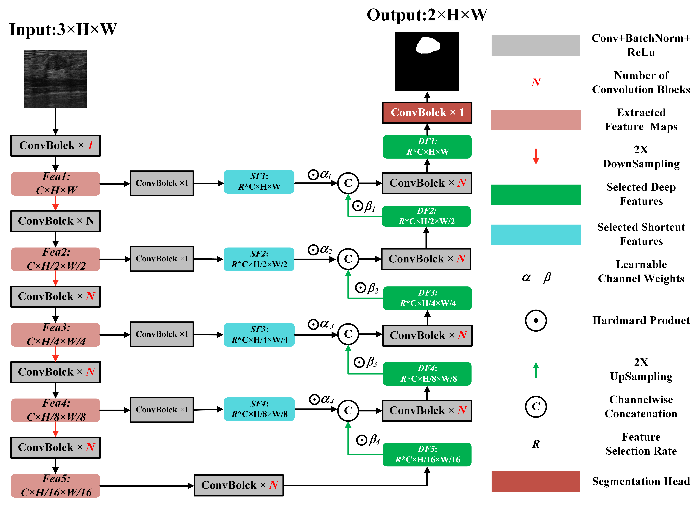

This is the official implementation of SimpleUNet, a novel, easily scalable yet high-performance semantic segmentation model for medical images(Only for 2D at this moment). Without fantastic novel components, SimpleUNet is implemented simply based on traditional U-Net by integrating interpretation-friendly feature selection, model width constraining (i.e., fixed model width for simplicity) and adaptive feature fusion. By doing so, the overall parameters can be greatly slashed while a variant with only 0.67 MB parameters can achieve comparable or even better performance against the SOTA models such as TransUNet, UNetv2, Tiny-UNet and ESKNet, especially for breast lesion segmentation in Ultrasound and endoscopic polyps, while showcasing promising performance on skin lesion segmentation.
# The architecture of SimpleUNet      

  

Also, the developed SimpleUNet can be simply advanced by replacing the common convolution blocks with novel components. However, it might be impossible to exhaustively explore these components. Nevertheless, we validate the extendability of our SimpleUNet on the basis of ESKNet, and many thanks to the great work of ESKNet,  which can be found at https://github.com/CGPxy/ESKNet. However, the original codes of ESKNet were implemented via TensorFlow. We, therefore, replicated them via Pytorch instead, on which we further extended our SimpleUNet as SimpleESKNet, which showed more competitive performance regarding breast lesion and endoscopic polyps segmentation. 

If you found this work interesting or helpful, please cite:  
@article{yu2025simple,  
        title={Simple is what you need for efficient and accurate medical image segmentation},  
        author={Yu, Xiang and Chen, Yayan and He, Guannan and Zeng, Qing and Qin, Yue and Liang, Meiling and Luo, Dandan and Liao, Yimei and Ren, Zeyu and Kang, Cheng and others},  
        journal={arXiv preprint arXiv:2506.13415},  
        year={2025}  
        }  
